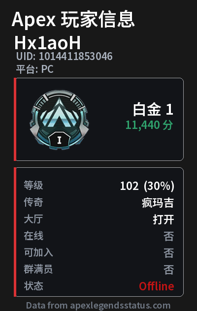
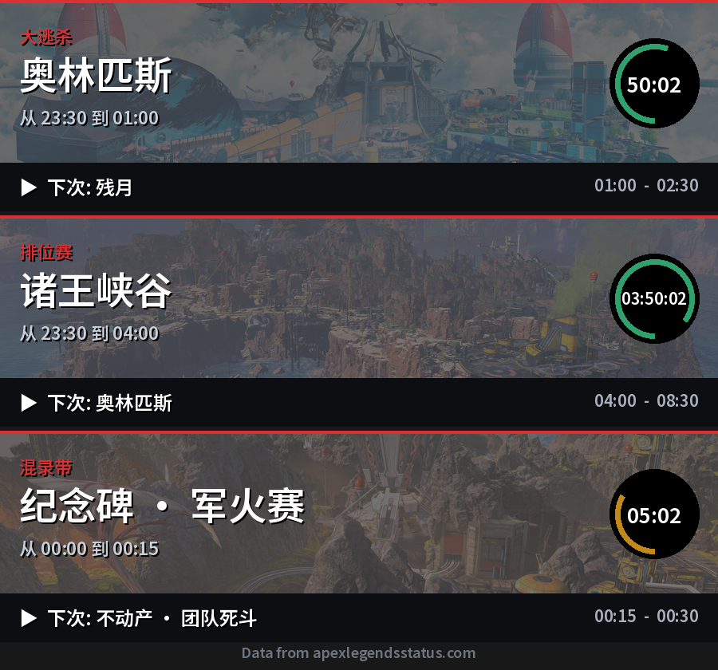
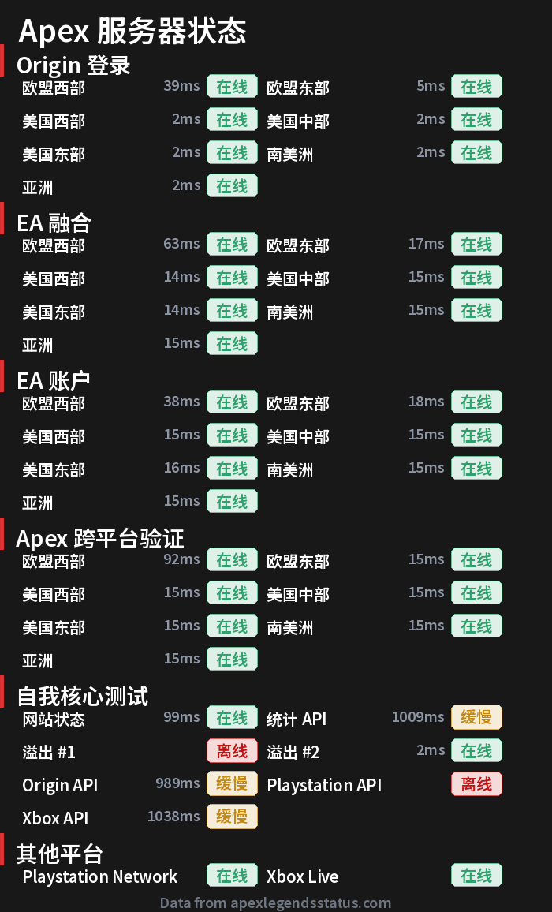
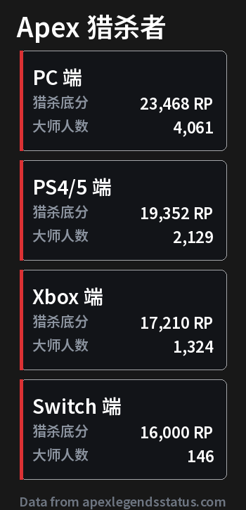

<div align="center">
  <a href="https://v2.nonebot.dev/store">
    
  </a>
</div>

<div align="center">

# NoneBot-Plugin-Apex-API-Query

_✨ 基于 NoneBot 的 Apex Legends API 查询插件 ✨_

<a href="https://registry.nonebot.dev/plugin/nonebot-plugin-apex-api-query:nonebot_plugin_apex_api_query">
  
</a>

</div>

## 📖 介绍

基于 NoneBot2 的 [Apex Legends API](https://apexlegendsstatus.com/) 查询插件，支持 **可视化图片卡片** 和 **纯文本** 两种输出模式。

- 查询玩家数据，自动对比历史记录并展示变化趋势
- 查询地图轮换（大逃杀 / 排位赛 / 混录带）
- 查询各分区服务器运行状态
- 查询各平台顶尖猎杀者排行分数

您可以在 [此处](https://portal.apexlegendsapi.com/) 申请您自己的 API 密钥。

申请密钥后重新在 [此页面](https://portal.apexlegendsapi.com/) 登录 API 密钥以测试密钥是否可用。

必须将此 API 密钥 [链接](https://portal.apexlegendsapi.com/discord-auth) 至您的 Discord 账户后您的 API 密钥才可用。

> 由于 API 的限制，您只能在查询玩家信息时使用 EA 账户用户名，而非 Steam 账户用户名。
>
> 数据由 API 提供，本插件仅作 **数据获取** 和 **内容转换**，如有内容错误均来自 API。

## 💿 安装

<details>
<summary>使用 nb-cli 安装</summary>

在 nonebot2 项目的根目录下打开命令行，输入以下指令即可安装：

```shell
nb plugin install nonebot_plugin_apex_api_query
```

</details>

<details>
<summary>使用包管理器安装</summary>

在 nonebot2 项目的插件目录下，打开命令行，根据你使用的包管理器，输入相应的安装命令：

<details>
<summary>pip</summary>

```shell
pip install nonebot_plugin_apex_api_query
```
</details>

<details>
<summary>poetry</summary>

```shell
poetry add nonebot_plugin_apex_api_query
```
</details>

随后编辑 nonebot2 项目根目录下的 `pyproject.toml` 文件，在 `[tool.nonebot]` 部分追加写入：

```toml
plugins = ["nonebot_plugin_apex_api_query"]
```

</details>

## ⚙️ 配置

在 nonebot2 项目的 `.env` 文件中添加以下配置：

| 配置项 | 类型 | 必填 | 默认值 | 说明 |
|--------|------|------|--------|------|
| `APEX_API_KEY` | str | **是** | `""` | Apex API 密钥，必须填写 |
| `APEX_API_URL` | str | 否 | `https://api.apexlegendsstatus.com` | API 地址（玩家/地图/服务器/顶猎共用） |
| `APEX_ONLY_TEXT` | bool | 否 | `False` | 是否仅使用纯文本输出（不渲染图片） |

示例：

```env
APEX_API_KEY = "你的 API 密钥"
# 以下均为可选配置
APEX_ONLY_TEXT = False
```

> 若设置 `APEX_ONLY_TEXT = True`，所有查询将仅返回纯文本，不会渲染可视化卡片。

## 🎉 使用

### 指令表

| 指令 | 说明 |
|------|------|
| `apex <玩家名称> [平台]` | 查询玩家信息（默认 PC 平台） |
| `apex m` / `apex map` / `apex 地图` | 查询地图轮换 |
| `apex s` / `apex server` / `apex 服务器` | 查询服务器状态 |
| `apex p` / `apex predator` / `apex 顶猎` | 查询顶猎分数 |

支持的平台参数：`PC`、`PS4`、`X1`、`SWITCH`

## 🖼️ 效果

默认以可视化卡片形式输出（设置 `APEX_ONLY_TEXT=True` 则回退为纯文本）。

### 玩家查询



### 地图轮换



### 服务器状态



### 顶猎排行



## 💖 鸣谢

- [@nonebot](https://github.com/nonebot) 强大的 [NoneBot2](https://github.com/nonebot/nonebot2) 机器人框架
- [@ProgramRipper](https://github.com/ProgramRipper) 数据库支持插件 [orm](https://github.com/nonebot/plugin-orm)
- [@yanyongyu](https://github.com/yanyongyu) 本地数据存储插件 [LocalStore](https://github.com/nonebot/plugin-localstore)
- [@anomalyco](https://github.com/anomalyco) 开源 AI Coding Agent [Opencode](https://github.com/anomalyco/opencode)
- [@deepseek-ai](https://github.com/deepseek-ai) 探索未至之境 [Deepseek](https://www.deepseek.com)

## 📄 许可证

本项目使用 [MIT](./LICENSE) 许可证开源。
